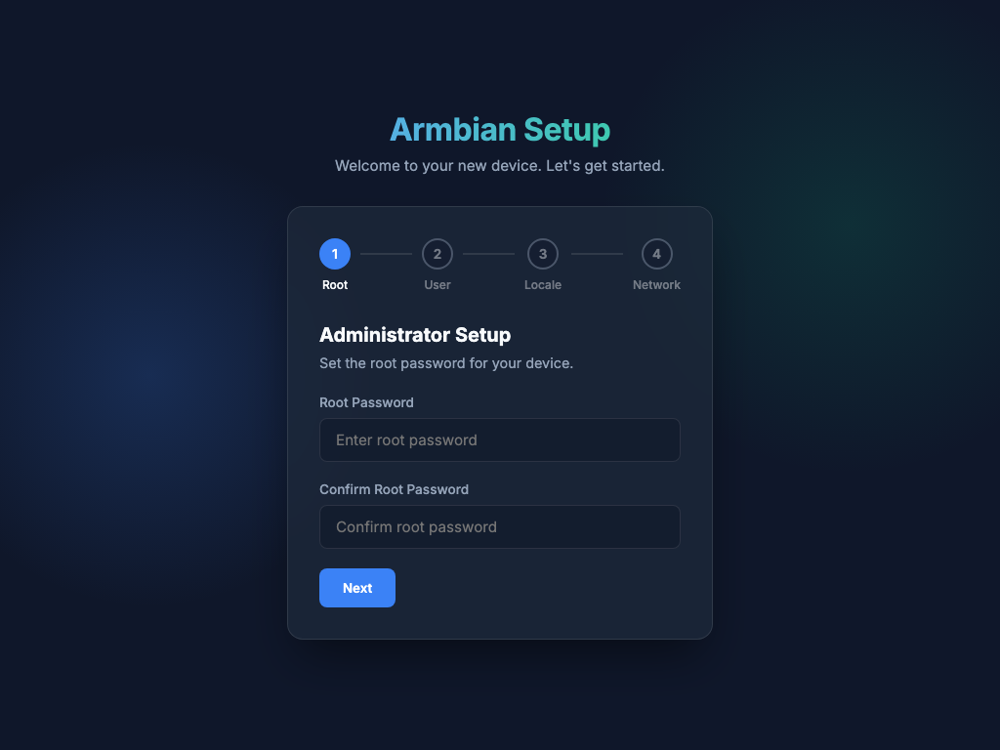
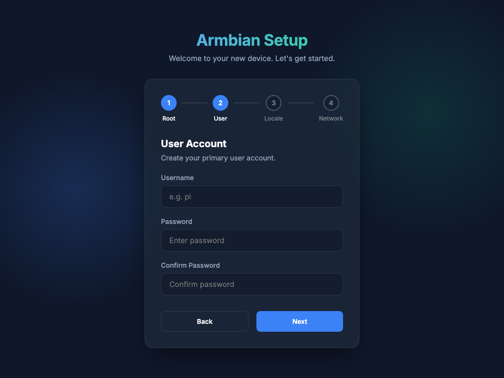
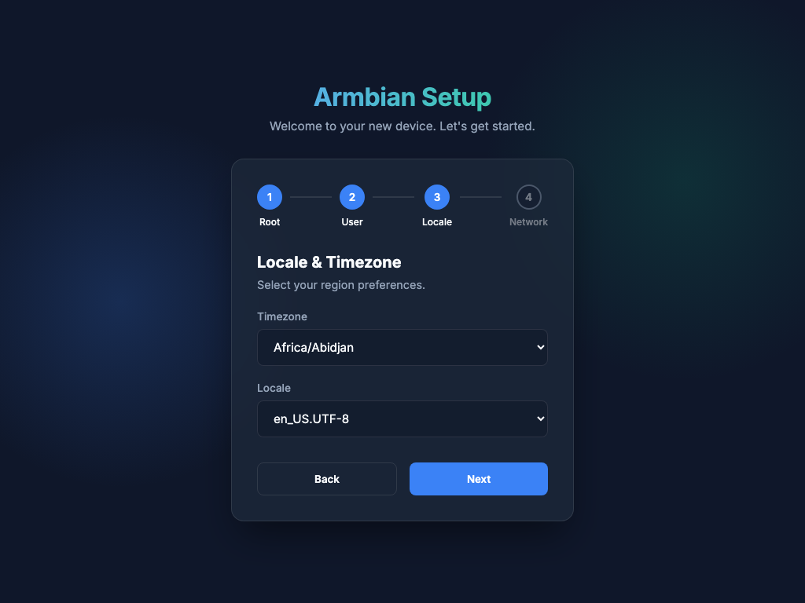
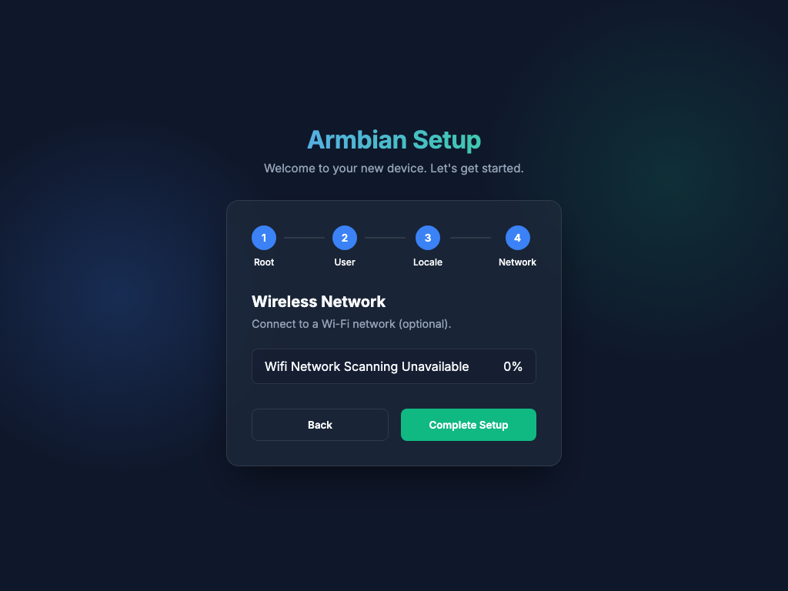

# Armbian Web Setup

A local web-based configuration wizard designed to help initialize newly flashed Armbian device. It guides the user through setting up admin and user accounts, configuring locales and timezones, and optionally connecting to a Wi-Fi network.

### Step 1: Administrator Setup
Set the root password for your device.

### Step 2: User Account
Create your primary user account and grant it sudo privileges.

### Step 3: Locale & Timezone
Select your preferred region and timezone.

### Step 4: Wireless Network
Connect your Armbian device to a local Wi-Fi network.

